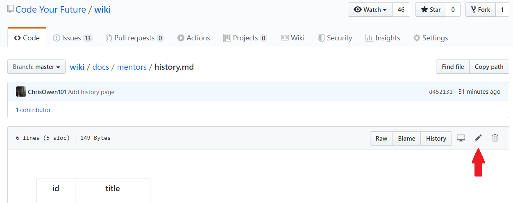
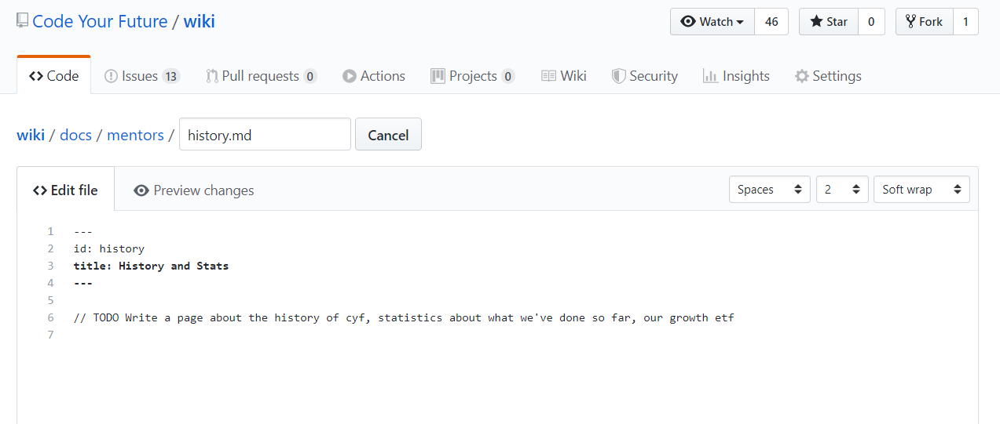
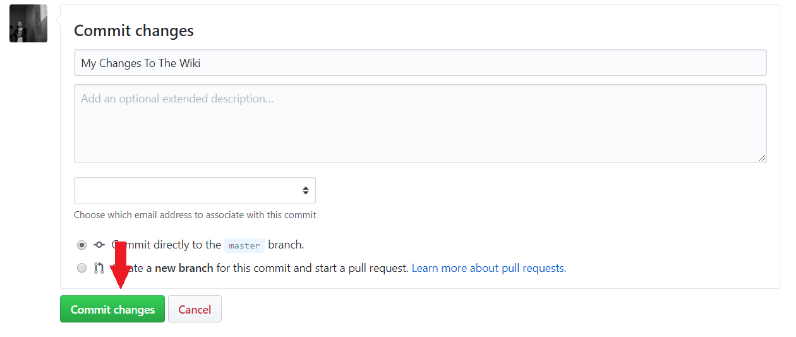
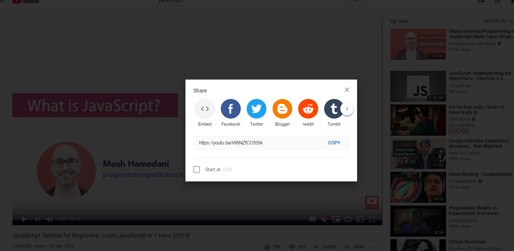
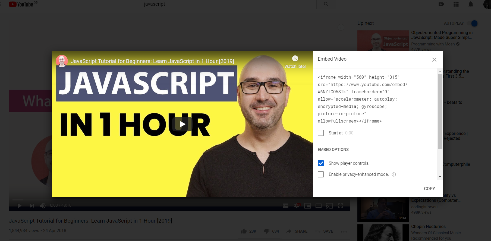

## Tools

**Docusaurus**

This website is built using the [Docusaurus](https://docusaurus.io) tool. You can find the documentation for it [here](https://docusaurus.io/docs/en/installation).

**Markdown**

All of the documents in this project use markdown to style the pages

https://guides.github.com/features/mastering-markdown/

**Typora**

We recommend using https://typora.io/ to edit and make changes to files. It allows for each formatting of text and easy integration of images.

## Getting Added to Github Teams

**Code Your Future Teams**

We use Github Teams to securely edit and update the Wiki. The broadest level team that you can be a part of it [Mentors](https://github.com/orgs/CodeYourFuture/teams/mentors) but many of the sub-teams will also work.

If you do not have access to edit the wiki please speak to a staff member or volunteer and ask them to add you [the Mentors group](https://github.com/orgs/CodeYourFuture/teams/mentors).

**Other People**

If you are not a member of Code Your Future, you are welcome to make a change but we ask that you Fork this repository and open a pull request.

## Making Changes

### Editing a Page on Github

At the top of every page in this wiki there is a small `Edit` button. Clicking this button will take you to Github.

When you reach Github you will see a small `Pen` button that looks like this:


Clicking the `Pen` button will take you to this `Editing Screen`:


When you've made your changes, scroll to the bottom of the screen and click the `Commit` button.


You changes will then be made public on the Wiki within 1-2 minutes

### Adding a Page

To add a page first create a file in the correct folder inside `docs`.

_e.g. If you wanted to add a student guide about Github you would create a file in `docs/students/guides/git.md`_

It is important that the file has this header at the top of it so that the website can find the file.

```
---
id: git
title: An Introduction to Git
---
```

The title is what appears at the top of the page (in a Title Style). The id is used to identify the page in links and the URL.

To make this appear in the Students side bar you must add a line in the `sidebars.json` file.

_e.g. You would add this line in the file_

```
"students": {
    "Tech Guides": [
      "students/guides/making-a-pull-request",
      "students/guides/git",
       ...
```

### Adding a YouTube Video and Embeds

To embed a YouTube video (or other HTML embed) you can do the following. First take the embed code from Youube



Then copy the code that is given to you



Go to your text editor and paste the embed as a block of code. When the website is online the content will be rendered as a video

## Trouble-shooting

Your changes may take a couple of minutes to be made visible at the site.

If you suspect the wiki build/deploy process has failed you can dig into the logs at https://github.com/CodeYourFuture/wiki/actions
