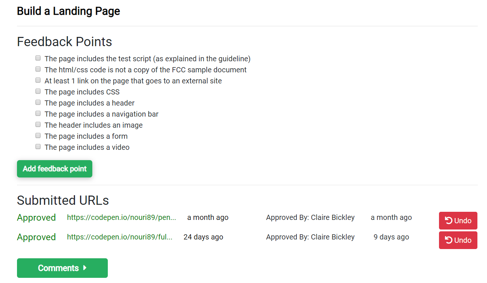
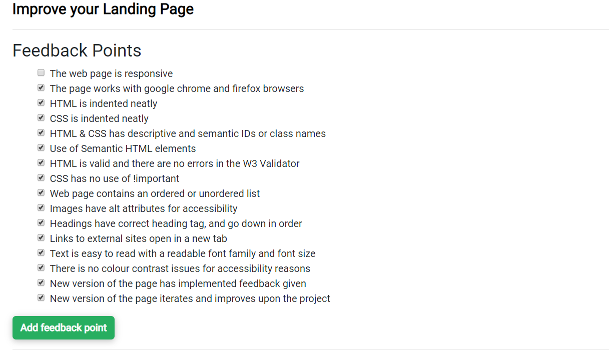

# Intro to Digital (ITD)

## Overview of the Intro to Digital course&#x20;

The steps are:&#x20;

1. Grasshopper Fundamentals I & II&#x20;
2. Free Code Camp&#x20;
3. FCC Build a Survey Form&#x20;
4. Build a Personal Home Page&#x20;
5. Create a career plan&#x20;
6. Write a motivational letter

## Register Online

First, the applicant must register on our [Application Process](https://application-process.codeyourfuture.io) website. It is through this portal that we manage all trainee applications. See [Dashboard](https://github.com/CodeYourFuture/DocsV2/tree/77ed5b10ac30abe661f64550e86020c12a3c3267/volunteers/tools/dashboard/README.md) for more details.

## 1: Google Grasshoper&#x20;

Applicants **can do these steps on a smartphone or using a laptop/desktop computer.** Upon completion, we can provide the applicant with a laptop so that they can continue studying further.

1. The applicant will need to create an account on Google Grasshopper.
2. Complete the course named Fundamentals 1&#x20;
3. Complete the course named Fundamentals 2&#x20;
4. Click the green download button. Download the pdf certificates and submit them to the dashboard.

## 2: FreeCodeCamp &#x20;

**This step should be completed on a desktop/laptop.** Where the applicant does have a laptop, ask them to visit the codeyourfuture.io website to contact us about a laptop loan for UK based trainees. Laptop loans are only available to UK residents.

**Register on FreeCodeCamp at this link:** [**https://learn.freecodecamp.org/**](https://learn.freecodecamp.org)

1.  Applicants need to make sure they are logged in every time they work on FreeCodeCamp, otherwise they will lose the work.

    1. They need to go to your free profile on FreeCodeCamp and change all of your settings to public:&#x20;
    2. Go to settings: https://freecodecamp.com/settings&#x20;
    3. In Privacy settings, set all the fields to public (including my portfolio, my points, my timeline).&#x20;
    4. On the top of the page go to 'Show me my public portfolio'

2. Complete the following tutorials on FreeCodeCamp. They are part of the Responsive Web Design Certification:&#x20;

`Basic HTML and HTML5`&#x20;

`Basic CSS`&#x20;

`Applied Visual Design`&#x20;

`Applied Accessibility`&#x20;

`Responsive Web Design Principles`&#x20;

`CSS Grid`

4\. Paste the URL link to your FreeCodeCamp profile in the field below and click Submit. We will be able to see if you have completed the tutorials.

\
5\. The link should look like this (the last part is their username): https://www.freecodecamp.org/fccfa2c11d1.[\
](https://learn.freecodecamp.org)

## 3: FreeCodeCamp> Codepen

1. Create an account on Codepen.
2. Open this template and save it to your Codepen account: [https://codepen.io/pen?template=MJjpwO](https://codepen.io/pen?template=MJjpwO)
3. Complete this FreeCodeCamp project in your Codepen template: [https://www.freecodecamp.org/learn/responsive-web-design/responsive-web-design-projects/build-a-survey-form](https://www.freecodecamp.org/learn/responsive-web-design/responsive-web-design-projects/build-a-survey-form)
4. Review Test Results: before they submit their code, they need to make sure all 17 tests pass. Making sure the test script is checking the Survey Form.

**Rules**

Do shoud not copy the HTML/CSS code of the sample solution FCC page. Your submission must be significantly different from the sample solution.[
****
\
****](https://www.freecodecamp.org/learn/responsive-web-design/responsive-web-design-projects/build-a-survey-form)****

**Submission**

Before submission, they need to sure that they have completed all of the Acceptance Criteria.

When the web page is complete, copy and paste the Codepen link to their page in the field below and press Submit.

## **4: Build a Personal Home Page**

Now they can build their own home page! Give it their own personal style. We know that people who do well on our courses show creativity, curiosity, persistence, and rigour. That’s what we’re looking from them in this project.

Fork the CYF starter page here: https://codepen.io/IntroToTech/pen/PomeEod

Applicants need to make sure theyr’re logged in to Codepen when they fork so the work is saved. They should use HTML and CSS to complete this project. Codepen has options to use extensions like SASS and Pug and they are feel free to use those if they want!

**Rules**

The page should tell us a bit about them, their interests and what excites them about tech or having a career in tech. This is all about them so they should be as creative as they like in telling us some of their story.

**Review Test Results**

Use and read the tests to discover the other 10 requirements. Build, test, and improve your code progressively. The tests are written in the Javascript window in Codepen for you to see, and there’s a readout in the main view showing the results. Don’t worry that you don’t understand the brackets and arrows, read the words. The tests will rerun every time you make a change in your code. Before you submit your code, make sure all 10 tests pass to the dashboard.

**Submission**

Before submission, they have to **** make sure that they have completed all of the Acceptance Criteria. When their web page is complete, they need to copy and paste the Codepen link to their page in the field below and press Submit.

**Feedback**

They will be getting feedback on this project from one of our volunteers. They have to make sure they check back to review your feedback. They will need to take this feedback and implement it in the next part of this project.

## &#x20;**4.1 Improve the Web Page**

They need to start with the web page that they completed in the previous step.

&#x20;Read the CYF webpage guideline document [HERE](https://docs.google.com/presentation/d/1WlPrmTLsj8KWElBzV-QXjihmSknZe8HODX6SKc\_JfIM/edit#slide=id.g6597527f42\_0\_9). Use the guidelines to improve your webpage

## 6: Product Landing Page Challenge _(Applicants Step 4.1)_

Next step of the application process is the Product Landing Page Challenge. This is the most intensive stage as we expect applicants to apply all the skills they have learnt so far and research additional skills independently in order to successfully complete the challenge. This page will be assessed as part of the selection process and therefore applicants should spend a lot of time iterating the page. Upon completing the first iteration, applicants are asked to share a link to the Product Landing Page on Codepen for assessment.

## 7: Product Landing Page Iteration Review and Feedback _(Applicants’ Step 4.2)_

In order to carry out this step, navigate to the Dashboard and view the Step 3 & Step 4 panels for each trainee.

All applicants should tick all the of the checkboxes before they can complete the step.

## 8: Product Landing Page Iteration _(Applicants’ Step 4.2)_

Iteration is a crucial part of the CYF culture - we want to ensure that students continually learn and strive to improve whatever it is they are doing and developing. That's why it is important to start building this habit from the very beginning. The ways in which applicants respond to feedback can also serve as an indicator of their aptitude for the course.

## 9: Interview Scheduling and Invites

Schedule a few interview days at least 3 weeks before the course start date to give yourself sufficient time to assess the candidates and make final preparations for the course. It will also help applicants, as they won’t all be available on just one interview day. Once applicants complete at least their first iteration of the Product Landing Page based on the Feedback in Step 7, invite them to an interview day.

Reach out to mentors and volunteers who can act as interviewers on the day. The average interview will take around 30 minutes. We advise having a pair of interviewers conducting each interview - this way you can get two points of feedback for each interview. For a group of 15 interviewers, we recommend having at least 5 interview pairs - this way you can complete interviews within a 3-hour window with some breaks in between.

## 10: Motivational Letter _(Applicants’ Step 5)_

Running up to the interview, ask an applicant to write a 300-word motivation letter discussing in detail why they would like to join CYF, what they would like to do with what they learn at CYF, and where they see themselves in 5 years. From our experience, asking for a motivational letter works best with our target group as a lot of them find this requirement intimidating and are a lot more likely to undertake it later on in the process.

Encourage the applicants to research answers to these questions using search engines. Applicants may not have immediate answers, but they will need to research these questions and this can be very helpful for their motivation and understanding of coding as a career choice.

This letter can also help to assess the level of English of an applicant – the course is delivered in English and places significant emphasis on the students' verbal and written communication skills. The earlier we can identify the potential problems with English, the sooner we can address them and suggest learning resources to applicants.

The motivation letter must:

* Show why they want to be a programmer
* Show why they are committed to our course
* Use good English
* Be longer than 300 words

## 11: Applicant Needs Survey

At this stage it is important to carry out an applicant survey to make sure that we are well aware of their support needs well in advance. Some applicants (and later students) will need help with travel, childcare, and/or internet expenses. Some won’t have laptops of their own. Some of them will not have bank accounts - making remote money transfers complicated. These need to be flagged early on to ensure that applicants who are invited to the interview days are able to attend and are not kept out of the course because they are unable to afford to travel to an interview or because they have caring responsibilities and are unable to cover childcare expenses.

## 12: Interviews

Interviews combine personal and technical assessment, with the goal of evaluating current circumstances, effort put into the application process and potential of the candidate. It is important to highlight that interviews intend to ascertain a candidate's potential. CYF are not looking for people who are developers already, instead we are looking for people who have the potential to become developers in 8 months’ time with our support.

Throughout the day and while students are waiting for their interview, engage students in activities and ask them to help each other. Teamwork is a crucial component of the course and you can use this time to make some preliminary evaluations about how interviewees interact within a group.

Split interviewers into pairs - you will need at least 1 technical mentor in each pair to ensure that the technical aspects of the Product Landing Page can be assessed. All interviewers in an interview group should fill in their own interviewer form - this way we can get 2 or more feedback points for each interview.

Please review the [Trainee Interview](../student-interviews/) section for more details.

## 14: Selection Day

In this step we try to work out who should be given a place on the course.

Please read more details on the [Selection Day](../selection-day.md) page

## 15: Selection

Once all data is collected, you can make suggestions for applicant offers or next steps. These are:

* Offer - applicant shows clear aptitude for the course and scores highly in at least 2 of the 3 categories. It is important to make it clear that all offers extended to applicants are conditional on their performance running up to and during the course.
* No Offer - applicant is not currently ready to join the course and will be encouraged to continue studying in order to be considered for the next course.

Once the summary is complete and proposals for offers have been made, share the summary with the team to ensure a fair assessment and selection process. Ask members to review offer proposals to be made and provide feedback with regards to any concerns they may have.
