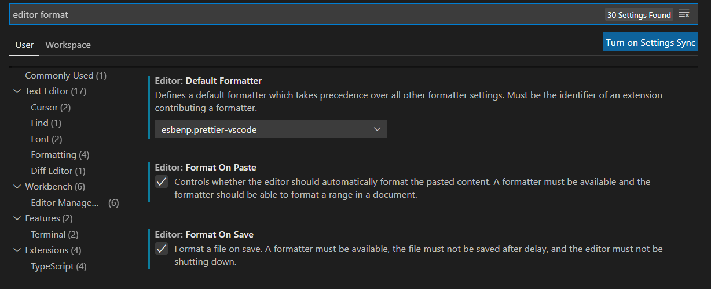

# Getting Setup

In this guide we'll explain everything you need to get ready for our course.

## 1\) Your Laptop

Please make sure that the laptop you are using meets the minimum specification for our course.

Check [here](laptops/minimum-laptop-specs.md).

If your laptop does not meet the minimum specification - please contact us for a replacement.

## 2\) Requesting Support

We can offer you a range of support whilst you are studying with us this includes

- Laptops
- Other computer hardware
- Childcare support
- Internet access
- Travel costs

**Please note:** Some of these levels of support may not be possible in the city that you attend. Please check with your city coordinator.

Please read [this page](laptops/requesting-a-laptop-or-support.md) for more details on how to access these services.

Make a backup of all of your essential files \(i.e. files you would be unhappy to lose\) from your laptop \(the one you use for CYF work\), to a DIFFERENT device.

## 3\) Backup Your Files

Over this course we may be asking you to install software or change your computer in ways.

When doing some certain tasks there is a very small risk of doing something wrong and this affecting some of the files on your laptop. For this reason we ask you to back up your laptop.

This also gives our volunteers the confidence to recommend different options when trying to make software work when it doesn't.

You could back up your files to

- The Cloud \(e.g. Google Drive or DropBox\),
- Another computer
- An external hard disk
- A USB stick

You MUST NOT back-up the files simply to another folder in the same laptop

You will probably have to research online to find your solution

## 4\) Operating System

You can complete our course on any Operating System we recommend that you use Linux.

If you need a laptop, please speak an organisers and we can provide you with one.

### Ubuntu \(Optional\)

We recommend using Ubuntu Linux to complete this course. This is an advanced computing skill but if you are comfortable installing this by yourself then you are welcome to, otherwise we can help you with this step.

[Download and install here](https://ubuntu.com/download/desktop)

### Windows

If you're using Windows we ask that you install this program to make it easier for us to help you during the course.

[Enable and install here](https://docs.microsoft.com/en-us/windows/wsl/install-win10)

## 5\) Visual Studio Code

### 5.1\) Install VSCode

We use VS Code to write all of our code in the course. It is known as an Integrated Developer Environment and really helps you write great code!

[Download and install here](https://code.visualstudio.com/)

### 5.2\) Extensions

We also recommend that you install the follow extensions in Visual Studio Code.

You can install them all in one go with our [extension pack](https://marketplace.visualstudio.com/items?itemName=CodeYourFuture.cyf-extension-pack) or select individual extensions below.

A guide to installing extentions [can be found here](https://code.visualstudio.com/docs/editor/extension-gallery).

**Essential**

- Prettier - Code formatter - Format your code automatically
  - [https://marketplace.visualstudio.com/items?itemName=esbenp.prettier-vscode](https://marketplace.visualstudio.com/items?itemName=esbenp.prettier-vscode)
- ESLint - Linter - Tells you when your code is wrong
  - [https://marketplace.visualstudio.com/items?itemName=dbaeumer.vscode-eslint](https://marketplace.visualstudio.com/items?itemName=dbaeumer.vscode-eslint)
- Code Spell Checker - Tells you when you've spelt something wrong
  - [https://marketplace.visualstudio.com/items?itemName=streetsidesoftware.code-spell-checker](https://marketplace.visualstudio.com/items?itemName=streetsidesoftware.code-spell-checker)

**Helpful**

- GitLens — Git supercharged - Connect with GitHub/Git
  - [https://marketplace.visualstudio.com/items?itemName=eamodio.gitlens](https://marketplace.visualstudio.com/items?itemName=eamodio.gitlens)
- Live Server - Run your code in the browser
  - [https://marketplace.visualstudio.com/items?itemName=ritwickdey.LiveServer](https://marketplace.visualstudio.com/items?itemName=ritwickdey.LiveServer)
- Live Share - Share your project with a team
  - [https://marketplace.visualstudio.com/items?itemName=MS-vsliveshare.vsliveshare](https://marketplace.visualstudio.com/items?itemName=MS-vsliveshare.vsliveshare)

### 5.3\) Enable formatting on save

We also suggest that you enable format on save so that your code stays formatted

1. In Visual Studio open the settings file \(see [here](https://code.visualstudio.com/docs/getstarted/settings#_creating-user-and-workspace-settings)\)
2. Search for `editor format`
3. Set `editor.formatOnSave` and `editor.formatOnPaste` to true
4. Set the "Default Formatter" to be Prettier

## 6\) Software

Although you _can_ install some of the following software onto a phone, it is required you install it onto your _laptop_.

### 6.1\) Chrome

Chrome is one of the best browsers for web developers with a great set of tools for testing and building websites

[Download and install here](https://www.google.com/chrome/)

### 6.2\) Slack

We use Slack to communicate with each other easily, to share files and to have video calls. You'll find all of your other students on here!

You'll need to login when you've download this. Speak to your teachers to get invited when you start the course.

[Download and install here](https://slack.com/intl/en-gb/downloads)

### 6.3\) Zoom

We use Zoom for bigger video calls such as weekend classrooms when they are remote.

[Download and install here](https://zoom.us/download)

### 6.4\) Node.js

We use this tool to run our code and later in the course to help us make websites.

[Download and install here](https://nodejs.org/en/download/)

### 6.5\) Git & Git Bash

We use this tool to upload our code to the internet so others can see it.

[Download and install here](https://git-scm.com/downloads)

### 6.6\) Github Desktop

We use this tool to make it easier to use Git since it can be quite hard for a beginner!

[Download and install here](https://desktop.github.com/)

## 7\) Websites

### 7.1\) Gmail

We use a lot of Google products in the class so it's essential that everyone has a Gmail address. If you do not already have one then please register below.

[Create email address here](https://accounts.google.com/SignUp)

### 7.2\) Github

We use Github to submit our homework and to share code with each other. Please make sure that you have created an account and are logged in before you attend your first lesson.

[Create account here](https://github.com/join)

### 7.2\) Github Team

As part of being a trainee at CodeYourFuture you should be a part of our Github Team.

Please speak to your city coordinator to get invited to your Classes github team or post on Slack.
