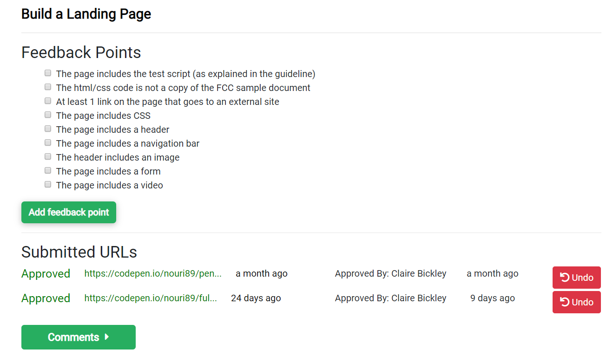
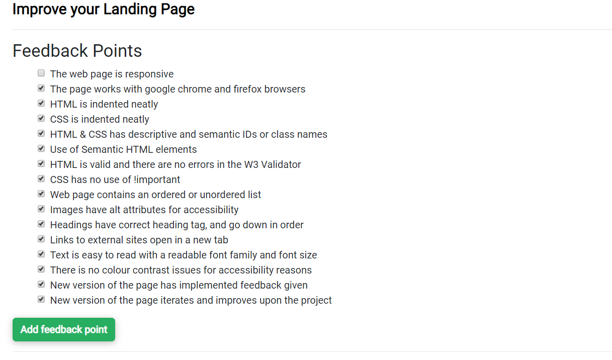

# Application Process

## Overview of the Application and Selection Process

## 1: Register Online

First, the applicant must register on our [Application Process](https://application-process.codeyourfuture.io/) website. It is through this portal that we manage all student applications. See [Dashboard](https://github.com/CodeYourFuture/DocsV2/tree/77ed5b10ac30abe661f64550e86020c12a3c3267/volunteers/tools/dashboard/README.md) for more details.

### \(Optional\) 2: SoloLearn Tutorials _\(Applicants’ Step 1\)_

Where the applicant does not have a laptop, ask them to complete first a basic tutorial on HTML/CSS/JavaScript using SoloLearn app on their smartphone. Upon completion, we can provide the applicant with a laptop so that they can continue studying further.

You can find the tutorials at [SoloLearn](https://www.sololearn.com/Course/HTML/).

To complete this step the student must submit a link to their SoloLearn Certificate

## 3: FreeCodeCamp Tutorials _\(Applicants’ Step 2\)_

Where the applicant does have a laptop, ask them to complete the Responsive Web Design Certification \(excluding CSS Grid and Responsive Web Design Projects\). It is a comprehensive tutorial that covers the basics of web design in a simple and digestible manner.

To complete this step the applicants are asked to make their FCC profile public and share a link to their profile to assess completion.

## 4: First Phone Call

While the applicants are working on the tutorials, it is important at this time to call an applicant and ensure that the application process is clear, have received an email and are actively working on it. A lot of applicants suffer from isolation and depression, so a call at this stage can provide a lot of motivation to students.

## 5: Tribute Page Challenge _\(Applicants’ Step 3\)_

Upon completing the tutorials, applicants are asked to create from scratch a Tribute Page Challenge on Codepen. This is the first opportunity for applicants to implement some of the skills they have acquired through tutorials. Once done, the applicants are asked to share a link to their Tribute Page on Codepen for assessment.

## 6: Product Landing Page Challenge _\(Applicants Step 4.1\)_

Next step of the application process is the Product Landing Page Challenge. This is the most intensive stage as we expect applicants to apply all the skills they have learnt so far and research additional skills independently in order to successfully complete the challenge. This page will be assessed as part of the selection process and therefore applicants should spend a lot of time iterating the page. Upon completing the first iteration, applicants are asked to share a link to the Product Landing Page on Codepen for assessment.

## 7: Product Landing Page Iteration Review and Feedback _\(Applicants’ Step 4.2\)_

In order to carry out this step, navigate to the Dashboard and view the Step 3 & Step 4 panels for each student.

All applicants should tick all the of the checkboxes before they can complete the step.

## 8: Product Landing Page Iteration  _\(Applicants’ Step 4.2\)_

Iteration is a crucial part of the CYF culture - we want to ensure that students continually learn and strive to improve whatever it is they are doing and developing. That's why it is important to start building this habit from the very beginning. The ways in which applicants respond to feedback can also serve as an indicator of their aptitude for the course.

## 9: Interview Scheduling and Invites

Schedule a few interview days at least 3 weeks before the course start date to give yourself sufficient time to assess the candidates and make final preparations for the course. It will also help applicants, as they won’t all be available on just one interview day. Once applicants complete at least their first iteration of the Product Landing Page based on the Feedback in Step 7, invite them to an interview day.

Reach out to mentors and volunteers who can act as interviewers on the day. The average interview will take around 30 minutes. We advise having a pair of interviewers conducting each interview - this way you can get two points of feedback for each interview. For a group of 15 interviewers, we recommend having at least 5 interview pairs - this way you can complete interviews within a 3-hour window with some breaks in between.

## 10: Motivational Letter _\(Applicants’ Step 5\)_

Running up to the interview, ask an applicant to write a 300-word motivation letter discussing in detail why they would like to join CYF, what they would like to do with what they learn at CYF, and where they see themselves in 5 years. From our experience, asking for a motivational letter works best with our target group as a lot of them find this requirement intimidating and are a lot more likely to undertake it later on in the process.

Encourage the applicants to research answers to these questions using search engines. Applicants may not have immediate answers, but they will need to research these questions and this can be very helpful for their motivation and understanding of coding as a career choice.

This letter can also help to assess the level of English of an applicant – the course is delivered in English and places significant emphasis on the students' verbal and written communication skills. The earlier we can identify the potential problems with English, the sooner we can address them and suggest learning resources to applicants.

The motivation letter must:

* Show why they want to be a programmer
* Show why they are committed to our course
* Use good English
* Be longer than 300 words

## 11: Applicant Needs Survey

At this stage it is important to carry out an applicant survey to make sure that we are well aware of their support needs well in advance. Some applicants \(and later students\) will need help with travel, childcare, and/or internet expenses. Some won’t have laptops of their own. Some of them will not have bank accounts - making remote money transfers complicated. These need to be flagged early on to ensure that applicants who are invited to the interview days are able to attend and are not kept out of the course because they are unable to afford to travel to an interview or because they have caring responsibilities and are unable to cover childcare expenses.

## 12: Interviews

Interviews combine personal and technical assessment, with the goal of evaluating current circumstances, effort put into the application process and potential of the candidate. It is important to highlight that interviews intend to ascertain a candidate's potential. CYF are not looking for people who are developers already, instead we are looking for people who have the potential to become developers in 8 months’ time with our support.

Throughout the day and while students are waiting for their interview, engage students in activities and ask them to help each other. Teamwork is a crucial component of the course and you can use this time to make some preliminary evaluations about how interviewees interact within a group.

Split interviewers into pairs - you will need at least 1 technical mentor in each pair to ensure that the technical aspects of the Product Landing Page can be assessed. All interviewers in an interview group should fill in their own interviewer form - this way we can get 2 or more feedback points for each interview.

CYF Template Interview Form: [Link](https://drive.google.com/open?id=1Ps6CEPPr_50hBmmXBPKwogAGRwnGnJr7GccUekdHqjM). It is a template that does not accept responses, to use it please copy the form and enable responses.

The interview form consists of three sections:

### 1. General Questions and Information

This section assesses the motivation of the student, their experience throughout the application process, their attitude to problem solving and team-work, etc. Instruct interviewers to make general brief notes throughout so they can reference these in Section 3.

When asking questions regarding availability for sessions and homework, look for evidence of proper planning and forethought. CYF offers a very intensive course that requires a lot of time. Thus, applicants who are already lacking for time \(i.e. working and studying at the same time already\) are unlikely to have sufficient time for the CYF course.

### 2. Technical Review

This section acts as both the Second Product Landing Review \(carrying on from Step 9\) and an opportunity to assess a candidate's knowledge. Ask mentors to assess Product Landing Page for evidence of improvement following the first round of feedback. This should be done against the remaining checklists on the applicant’s Trello Card. At the same time, mentors can ask applicants questions on how they approached the Product Landing Page challenge and their response to feedback.

Following the questions, ask the applicant to explain some aspects of their code, why they used it and its functionality. Look for evidence of comprehension and understanding of the purpose of the code. In special cases, look for evidence of code copying - where there is evidence of coping without understanding, interviewers can challenge the origin of the code. Some copying can be permissible though will need to be fixed by rewriting the code, but outright plagiarism cannot be tolerated.

### 3. Interviewer Feedback

At this time the interviewee can be allowed to go. In Section 3, interviewers are asked to rate an applicant against a number of statements on a 1 to 10 scale. They are also asked to provide feedback on interviewees as a statement.

## 14: Collating Interview Data

Collate data from the interviews into a format shown in the template file [here](https://docs.google.com/spreadsheets/d/1KZqDX7oxFEv17WDEkg87q5c7HAVlw62F-IayOksvgNA/edit?usp=sharing).

### Legend

* Days since first feedback round - a count of days without Product Landing Page improvement since feedback was sent.
* Days since applied - a count of days since the applicant applied and they had to complete the application process.
* Offer - scholarship offer status.
* Avrg. Interviewer Score - is the average score from both interviewers from all 1 to 10 statements from Section 3.
* Code Explanation - is the score interviewees receive in Section 2.
* Webpage Score - is the score of the Product Landing Page as based on the Trello Card score i.e 22/28 = 79%.
* Details - brief summary where applicants disclosed circumstances of the challenging circumstances they are facing.
* Interviewer Feedback - interviewer statement from Section 3.
* Applicant Team Feedback - feedback from the team that worked with an applicants with regards to personal circumstances and constraints not mentioned elsewhere, communication, feedback response, general motivation etc.

## 15: Selection

Once all data is collected, you can make suggestions for applicant offers or next steps. These are:

* Conditional Scholarship Offer - applicant shows clear aptitude for the course and scores highly in at least 2 of the 3 categories. It is important to make it clear that all offers extended to applicants are conditional on their performance running up to and during the course.
* Request for Product Landing Page Improvement - applicant shows aptitude for the course and scores at least higher than 7 in interviewer scores. However the page score is low and needs improvement and further assessment.
* No Offer - applicant is not currently ready to join the course and will be encouraged to continue studying in order to be considered for the next course.

Where requests for further product landing page improvement are made, applicants will need to be notified and supplied with feedback on improvements to be made. If possible, they should also undergo another round of interviews.

Once the summary is complete and proposals for offers have been made, share the summary with the selection team to ensure a fair assessment and selection process. Ask members to review offer proposals to be made and provide feedback with regards to any concerns they may have.

