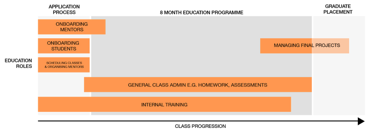

In this section you'll find all the information to do with the education team.

## Responsibilities

The function of this team varies due to the stage within the cohort:

- Initially, the Education Team is responsible for finalising the syllabus & scheduling the course
- From here, the team must welcome & onboard mentors, and organise mentor/assistant distribution throughout the course
- The role then shifts to focusing on general class admin, covering class organisation, homework, assessments etc.
- As a cohort nears completion, the education team then focus on managing final projects, and assisting students to continue these beyond graduation

## Meeting Documentation

### Online Class Agenda

Outline and agenda for each of our classes. A duplication of this should be created for each our lessons.

[Find it here](https://drive.google.com/open?id=1iYtzjCuFt1Jz_0avn_pqx391vofBcL7pi7FieMyKado)

### Online Homework Club

We run regular homework clubs with our partners which provide valuable mentoring to our students. Below you can find an example schedule for an event.

[Find it here](https://drive.google.com/open?id=1-T-nhMTrmkY0JIuHUNIIsoqgN2rU1QYoh3-SAoSemTE)

### Weekly Education Team

Every week, the education team meets to speak about the progress of the class so far and what need to be planned. Below you can find an example agenda for one of these events.

[Find it here](https://drive.google.com/open?id=170_-B-ZQuT5IsSMm-0Na7hWJzS7aaa18ULP1EZP6_zo)

## Teacher Training

At Code Your Future we believe, as we have always done, that finding professional programmers to deliver our course best prepares our students for professional life by giving them the most up to date knowledge and helping them build a network of developers for when they graduate.

The problem lies in the fact that we are people who are passionate about teaching but have no formal background in it. We do well using the skills that we have but without some background in teaching we make mistakes both developing and delivering content. The result of this is our students receiving an education that while passionate and caring can miss out on some of the core education principles which would enable them to learn better and thus become developers easier.

These problems can manifest themselves in students not understanding key concepts, struggling with homework or becoming discouraged with the course.

You can find our teacher training resources here:
[https://teachertraining.codeyourfuture.io/](https://teachertraining.codeyourfuture.io/)
