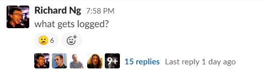

[Online-teaching: Home](online-teaching.md)
| [Start-of-class checklists](online-start-of-class-checklists.md)
| [Online fun](online-fun.md)
| [Zoom training call overview](zoom-training-call-overview.md)

## Zoom Client Setup (everyone)

We recommend using [Zoom](https://zoom.us) for online classes because

- It supports breakout rooms that are useful for group tasks
- It enables screen sharing, a great way to share one's work or issues with a program or to simply speak up
- It accommodates very large numbers of attendees

We suggest that everyone [downloads the client now](https://zoom.us/download).

## Zoom hosting account setup (only admininstrators)

Zoom account **owners** should follow [these config instructions](online-teaching-settings.md) to customise the settings for all future calls made from that account.  

Account owners are currently Germán, Neill, Gianluca.

## Classes

Broadly, the setup of our class rooms is the same as our physical classroom. This means as closely as possible it should [keep to the structure of our physical classes as outlined hre](https://docs.codeyourfuture.io/volunteers/running-a-class).

Each classroom room should have no more than 25 students and enough breakout rooms to accommodate 3-4 students per room. Each breakout room should have a teaching assistant who is there to help and mentor the students during the exercise.

### Classroom Setup

It is the responsibility of the Assistant Lead teacher to `Host` the Online Classrooms and make sure the Zoom space is set up correctly for learning. This will involve:

- Making sure all the students can access the class correctly
- Assign all students and volunteers to the breakout rooms that they'll be in for the day
- Making all classroom participants `co-hosts` so they can move themselves to and from breakout rooms at their will
- Enable `simultaneous screen share` by clicking `^` next to their own share button

## Communication in Class

### Communication between Teachers

We recommend you use Slack - make and use a custom channel or group chat especially to communicate between teachers not in the same call. This is important so messages don't get lost and all teachers are kept in the loop.

London, for example, will use [#london-teachers-during-class](https://app.slack.com/client/T2H71EFLK/C0109KRLYTS/thread/C010D1C41K2-1584699383.012200)

For teachers and TAs in the same virtual classroom you can also use:

- Audio in the main room! Simple works!
- A dedicated breakout room for teachers' & TAs - normally the main room is fine

### Communication between Students

Students should be directed to ask questions in the Slack Channel. We suggest creating a new thread for each teaching section where all questions should be asked. It is the responsibility of one Teaching Assistant to keep track of questions.

## Classroom Roles

#### Coordinator

- Make sure the teachers understand the content for the week
- Debug technical problems the students are having
- As students and volunteers join, confirm that their video and audio are working

#### Lead Teacher

- Lead teaching sessions and deliver content
- Introduce homework for the week to the class

#### Assistant Lead Teacher

- Host and administer the video call
  - Start the video call
  - Mute noisy people who are not speaking ("mute all" is useful and temporary)
  - Bring important questions to the teacher's attention
  - Assign people to Breakout rooms
- Manage the timing for the day
  - Make sure that parts of the lesson start and finish on time.
- Answer calls for help from the breakout rooms

#### Assistant Teachers

- Support the teacher
- Listen for the teachers' instructions to students
- Guide exercises in the breakout rooms (if necessary)
- Moderate and guide the students' discussions during exercises

#### Energiser

- Coordinate the morning and afternoon energisers
- [Online fun](online-fun.md) - an under construction list of fun, silly energizers, games and non-technical exercises, suitable for remote classrooms.

## Tips & Techniques

- Above all else remember that _"You are fighting against boredom and disengagement"_ when teaching online. It is so easy for students to stop listening when they're not physically in the room
- Enforce all students to have their webcams on - this helps with keeping the students engaged
- We recommend using `Gallery` mode to view all of the students at once. You change this from the top right of your school
- Use _Popcorning_ when asking an open question
  - This technique is where a student gives an answer and then selects another to give their answer.
  - This helps keep students engaged
- Use emoticons to keep a pulse on student progress
  - Use them to initiate checks of understanding, activities, voting, progression cues, and participation exercises
  - For example in this Slack post the teacher uses a confused emoji to tell if some students don't understand the question
  - It's important that you add the emoji first yourself so that it's easy for students to follow

- Use the webcam to your advantage
  - To check if students are understanding ask them to nod or shake their head to answer
  - This introduces some student accountability

## Headset recommendations

**Sennheiser SC30** (£15-£40)

The Sennheiser SC30 has good sound quality, is lightweight (comfortable for long use) and cheap (£15 previously owned on ebay).  (Recommended in [this article](https://ma.tt/2020/03/dont-mute-get-a-better-headset/)).

Cons: 

* It will take up another USB port (USB A) on your computer (and won't plug in to a phone at all).  A student running an external web cam, mouse, keyboard, and USB headset is likely going to need a USB hub (£10).

* It has a frivolous volume control hardware half-way down the cable which, for me, tends to snag on the desk and has resulted in cable damage (400 hours in, with a pre-owned item). (I'll buy the same again!)

**Jabra Evolve 40** (£40 -£80)

These were recommended by a CYF Scotland volunteer.  Expensive when at full price, but £40 on ebay.

**Your recommendation here**

Don't hesitate to edit this page to add a recommendation!

**Testing your sound.**
Use an online service to record and play back your mic, to let you hear how it sounds.  When testing this way, be sure speak energetically and animatedly as you hopefully would when teaching, with the microphone at the same position as you intend to use it, or you won't hear issues of boominess and plosive sounds that occur at higher speaking volumes.  Ask your fellow teachers and your students!
(If you hear that a fellow teacher's sound isn't great, let them know!)

## Student Training

We use Zoom training calls to up-skill our volunteers and students. 
* You can find the agenda for such a call here: [Zoom training call overview](zoom-training-call-overview.md)
* Teachers can request a training call from Neill Bogie on Slack or ask in #zoom-questions

## Who to ask for help

[Online-teaching: Home](online-teaching.md)
| [Start-of-class checklists](online-start-of-class-checklists.md)
| [Online fun](online-fun.md)
| [Zoom training call overview](zoom-training-call-overview.md)
