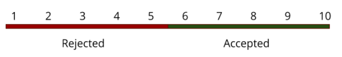

The selection day normally happens within one to two weeks after interviews and is when we collate all of the data that we have on our applicants and decide - as a group - who will be brought forward onto the full course.

The selection process should take between 1-3 hours depending on the amount of applicants you are evaluating.

## Aims

- To select the best possible applicants to be on our course
- To find applicants who may be too advanced for the course and for who we should find alternative arrangements
- To ensure the class balance meets CodeYourFuture’s [inclusivity aims](https://docs.google.com/spreadsheets/d/1rZ02vQ3Jirsd2hFVgTN0F6xKJF6yCdDH4nHJMwLjx2Y/edit#gid=0)

## Selection Categories

When you’re evaluating the applicant you should be keeping in mind that they may fall into one of three categories.

1. **Rejected**
   - This applicant is not currently ready to start our course. See reasons below.
2. **Accepted**
   - This applicant is ready to start the course and should be accepted
3. **Accepted but Advanced**
   - This applicant is ready to start the course but has a very significant amount of knowledge beyond a beginner.

### Why might an Applicant be rejected?

An applicant might be rejected because of a variety of reasons. For example:

- Personal Interviews
  - The applicant’s English (reading, spoken or written) were graded poorly
  - The applicant did not seem to understand what it meant to be a programmer
  - The applicant could not sufficiently explain when they would find time to work
  - and many more…
- Technical Interviews
  - The applicant could not sufficiently explain the code that they had written in the application process
  - The applicant obviously did not work on the technical challenge by themselves
  - and many more...
- Motivation Letter
  - The English used in the letter is poor
  - The applicant does not sufficiently explain why they want to join the course
  - and many more…

Often an applicant will be rejected for a selection of reasons spanning across their interview, technical work and motivation letter.

### What is “Accepted but Advanced”?

A small but significant portion (historically 15-20%) of the people who apply and reach the selection stage have had a significant amount of experience with programming already.

It is important that while we should not reject these people - they still come from disadvantaged backgrounds and should not be penalised for knowing too much - however advanced applicants can be very disruptive in class for applicants without experience and it may not be the best use of their time.

An “Accepted but Advanced” applicant could look like

- An asylum seeker who completed a Computer Science education in their country of origin but has no professional experience
- An amateur enthusiast who has spent years learning how to code in their own time because they have been unable to afford a bootcamp.
- A professional software engineer, refugee who has recently been given Right To Remain and is now looking for a job.

For applicants who fit into this category alternative avenues to employment might be

- Applying for work through CodeYourFuture’s network
  - If they have worked professionally before or are very advanced
- Working on Tech Projects to gain experience
  - These are internal tools that we use at CodeYourFuture that look good on a CV
  - Applicants will also receive employment coaching during this time

Whilst they’re working towards employment they should also be invited to

- Support as Teaching Assistants
  - In this capacity they are given the ability to help applicants whilst also consolidating their knowledge

It is essential that all “Accepted but Advanced” applicants are considered on a case by case basis. By their very nature, they are edge cases and must be treated as such.

It’s important that the Applicant is involved in any discussions around their involvement in the course.

## Selection Process

### Before the Meeting

Make a copy of this template to organise all of the information we have on the applicants

[[TEMPLATE] CodeYourFuture Applicant Selection](https://docs.google.com/spreadsheets/d/1SLzDiz2y3VH3ilWb4PB7_sZAQqo-uaMHT7I-_690aPM/edit?usp=sharing)

### During the Meeting

The aim of this event is to decide which category each of the applicants should fit into.

Everyone should split into small teams and begin to work through sets of applicants methodically. Initially, you will be looking for the obvious outliers in the applicant pool - the people who are obviously not ready for the course and the people who obviously are. It is important that you take notes on the spreadsheet to justify your decisions.

After this, you will have a selection of people who will be more towards the line, you may also have difficult decisions to make if you have a limited size of class.

#### Resolving Conflicts

For every applicant where decisions are split

- One person should stand in defence of the applicant
- One person should stand in opposition to the applicant

Each representative will then have one minute to debate on behalf of the applicant using knowledge that they have from the information available.

After they have debated, all attended must cast a vote either for or against the applicant. If a consensus cannot be reached leave the applicant for the time being and return at the end of session.

### After the Meeting

Be sure to communicate the results of the Selection Day to applicants as soon as possible

## Ranking Applicants

Applicants should be ranked on a scale of 1-10 where

You can **only** rank applicants in whole numbers (i.e. 5.5 is **not** allowed)

Below you can find a grading rubric for each of the ranks.

You will find that applicants will often fall between rankings - try to find the most appropriate place for the applicant and record your thoughts in the notes.

### Previous Technical Experience

The aim of the technical assessment is to work out if the student should go into the “Accepted But Advanced” group.

This is a non-exhaustive list of qualities that each group might have.

**Advanced**

- The applicant already knows another programming language
- The applicant has used Node/React/MongoDB in a personal project
- The applicant has professional programming experience
- The applicant studied and graduated from a Computer Science/Software Engineering Degree at University level

**Beginner**

- The applicant has some self-taught programming experience from online learning
- The applicant studied some level of programming education at secondary school or college

**None**

- The applicant has no or very limited prior programming experience before starting the application process

### **Assessment Areas**

1. **English Level**

Using the _Interview Notes_, Interview _English Test Results_ and _Motivation Letter_ decide which category the applicant would fit into

**Very Poor**

- It was often hard to understand the applicant when speaking
- It was often hard to judge what an applicant meant when speaking
- The applicant struggled to create full spoken sentences
- The applicant could not properly answer questions because they didn’t understand what was asked
- The applicant could not construct full written sentences
- The applicant could not successfully complete the English Test in the interview

**Poor**

- It was sometimes hard to understand the applicant when speaking
- It was sometimes hard to judge what a applicant meant when speaking
- The applicant struggled to create full spoken sentences
- The applicant could not sometimes properly answer questions because they didn’t understand what was asked
- The applicant could not successfully completed the English Test in the interview

**Average**

- It was fairly easy to understand the applicant when speaking
- It was fairly easy to judge what a applicant meant when speaking
- The applicant could successfully complete the English Test in the interview with some errors
- The applicant could write in full simple sentences

**Good**

- It was easy to understand the applicant when speaking
- It was easy to judge what the applicant meant when speaking
- The applicant could properly answer questions because they understood what was asked
- The applicant could successfully complete the English Test in the interview
- The applicant could write full and complex sentences

**Very Good**

- The applicant could communicate clearly and succinctly when speaking
- The applicant could always write in complex, complete sentences
- The applicant could successfully complete the English Test in the interview

2. **Motivation & Careers**

Using the applicants _Interview Notes_ and _Motivation Letter_ decide which category the applicant would fit into

**Very Poor**

- The applicant did not say why they wanted to be a developer (e.g. creating software, solving problems etc)

**Poor**

- The applicant only listed generic reasons for wanting a job (e.g support family, have money)
- **Average**

- The applicant showed some understanding of what a developer does
- The applicant showed excitement at the idea of becoming a programmer

**Good**

- The applicant showed some evidence of wanting to be a developer in particular
- The applicant gave specific reasons for wanting to be a developer
- The applicant had researched coding previously

**Very Good**

- The applicant showed concrete evidence of wanting to be a developer in particular
- The applicant showed concrete understanding of what a developer does
- The applicant had started practicing coding already

3. **Technical Skill & Self Teaching**

Using the _Technical Interview Notes_ and _Technical Work from the Application Process_ decide which category the applicant would fit into

**Very Poor**

- The applicant performed poorly in the technical part of the interview (Score 1+)
- The applicant did not mention self-teaching or how they would achieve it

**Poor**

- The applicant performed poorly in the technical part of the interview (Score 3+)
- The applicant did not give examples of self-teaching but referenced it

**Average**

- The applicant performed averagely in the technical part of the interview (Score 5+)
- The applicant only gave examples of self-teaching from the application process (i.e. FreeCodeCamp)

**Good**

- The applicant performed well in the technical part of the interview (Score 7+)
- The applicant showed they understood the scale of the challenge
- The applicant has given specific examples of having self-taught a non-programming subject

**Very Good**

- The applicant performed very well in the technical part of the interview (Score 9+)
- The applicants went beyond the requirements in their submitted website
- The applicant has given specific examples of having self-taught programming
- The applicant gave specific examples of overcoming and solving a programming issue

4. **Personality & Community**

Using the _Interview Notes \_and \_Motivation Letter_ decide which category the applicant would fit into

**Very Poor**

- The applicant actively disliked the idea in working with others or being part of a community
- The applicant was impatient or rude during the interview
- The interviewer gave the applicant a score of 1+ for the question “The applicant will be a good fit for CodeYourFuture”

**Poor**

- The interviewer gave the applicant a score of 3+ for the question “The applicant will be a good fit for CodeYourFuture”

**Average**

- The interviewer gave the applicant a score of 5+ for the question “The applicant will be a good fit for CodeYourFuture”
- The applicant was interested in the idea of giving back after learning

**Good**

- The applicant understood and explained why working in a group is good for learning
- The interviewer gave the applicant a score of 7+ for the question “The applicant will be a good fit for CodeYourFuture”

**Very Good**

- The applicant was actively interested in joining a community of learners
- The applicant gave concrete examples of having given back in the past (e.g. volunteering, community work)
- The interviewer gave the applicant a score of 9+ for the question “The applicant will be a good fit for CodeYourFuture”

## Rank Levels

### 1 - Very Strong Rejection

You should give an applicant this ranking if:

- The applicant scored a Very Poor in more than one of the categories

### 2 - Strong Rejection

You should give an applicant this ranking if:

- The applicant scored Very Poor in one of the categories
- The applicant scored Poor in one or more of the categories

### 3 - Rejection

You should give an applicant this ranking if:

- The applicant scored Poor in most of the categories

### 4 - Weak Rejection

You should give an applicant this ranking if:

- The applicant scored Poor in one or more of the categories
- The applicant scored Average in the rest of the categories

### 5 - Borderline Rejection

You should give an applicant this ranking if:

- The applicant scored Poor in one or more of the categories
- The applicant scored Average in the rest of the categories

### 6 - Borderline Acceptance

You should give an applicant this ranking if:

- The applicant scored Good in one or more of the categories
- The applicant scored Average in the rest of the categories

### 7 - Weak Acceptance

You should give an applicant this ranking if:

- The applicant scored Average in one or more of the categories
- The applicant scored Good in the rest of the categories

### 8 - Acceptance

You should give an applicant this ranking if:

- The applicant scored Very Good or Good for one or more of the categories
- The applicant score Good or Average for the rest of the categories

### 9 - Strong Acceptance

You should give an applicant this ranking if:

- The applicant scored Very Good for one or more of the categories
- The applicant scored Good for the rest of the categories

### 10 - Very Strong Acceptance

You should give an applicant this ranking if:

- The applicant scored Very Good in most of the categories
- The applicant scored Good in some of the categories
