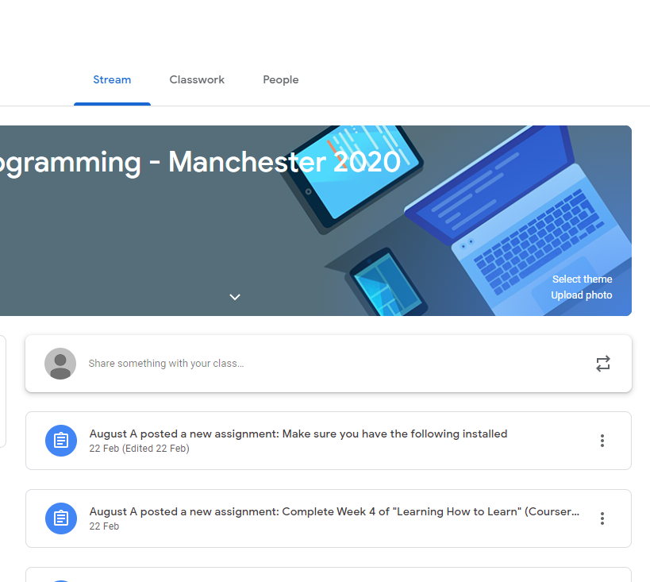
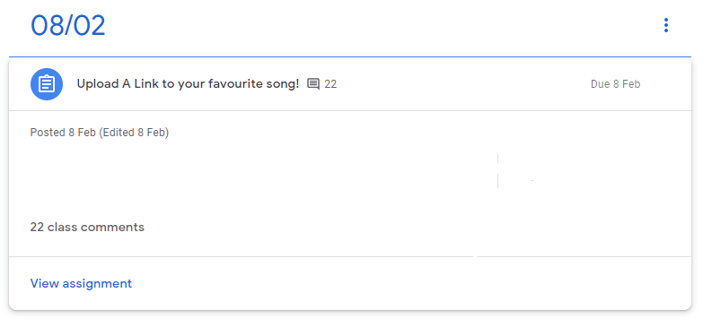
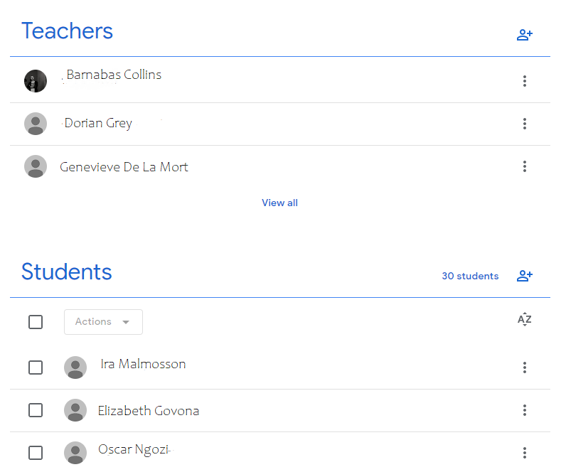

### Joining Google Classroom

When the Classroom is set up, the mentors will make the classroom's code available to everyone. You may be asked to provide your email address so you can be invited to join the class. When you sign in to your Google account and head to [Google Classroom](https://classroom.google.com), you should be able to see the class you've been invited to and you can simply click 'accept' to join. If you cannot see your class, please click the plus button and, when asked to do so, enter the class code. This will let the mentors with access to Classroom know you're trying to join and you will be given access.

### How Google Classroom works

There are three main tabs in the Classroom: **Stream**, **Classwork** and **People**. Below, we'll look at what each tab does.

#### Stream

Stream works a little bit like a social media feed. Here, you'll be able to see announcements and assignments from the mentors. Announcements may be important information about classes or homework. You can add comments to these posts by using 'add a comment' underneath the specific post. Assignments are homework. You will usually have a deadline by which you must submit your homework. Any homework you have will be visible in the classwork tab.

#### Classwork

To see what a piece of homework is, you can click 'view assignment' or the title of the homework. You will then see instructions on what the task is and what you need to submit to complete the homework. This can be anything from leaving a link to your GitHub to a short piece of writing. If you are ever confused by the instructions, please let your mentors know and they can explain the task again or even update the instructions to make them clearer for everyone.

Once you're ready to submit your homework, use the 'turn in' button. You will notice you can add files under the section 'your work' which is where you will also find the 'turn in' button. Be sure to attach any necessary links or files before clicking 'turn in'.

If you would like to edit a piece of homework, click 'unsubmit', make any edits, then click 'turn in' again. Please note, however, that if you try to make edits after the deadline and resubmit, your homework will be marked as 'late' in Google Classroom, even if you originally submitted on time.

#### People

    
(Student and teacher names have been changed to protect privacy.)

The people tab will simply show you a list of teachers (these will be mentors on the course) and a list of your classmates.

### Tips on using Google Classroom

- When writing comments, be sure to use the shift key and enter to move to a new line. Pressing enter alone will send your comment.
- Comments can be public (the whole class can see) or private (only the mentor(s) can see). When making comments on the Stream tab, your comments will be made visible to everyone. If you're in an assignment, you will also see the option to make a private comment. In this case, only the mentor(s) will be able to see your comment. This can be helpful if you have a question about some feedback you received, for example.
